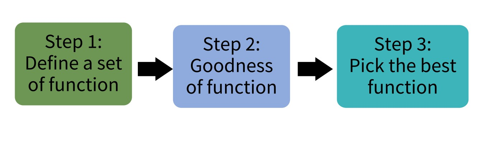

# Deep Learning

This repository keeps record of Deep Learning Course (ID: 521153S-3003) from University of Oulu, Finland.

## Packages

- Python 3.8
- Pytorch 1.10

## Content

- Linear regression, loss function, gradient descent, regularization

- Linear Classification 

  -Examples: Pedestrian detection, Email spam detection, Tumor detection, Object classification
  
- Softmax Classifer (Multinomial logistic regression)
