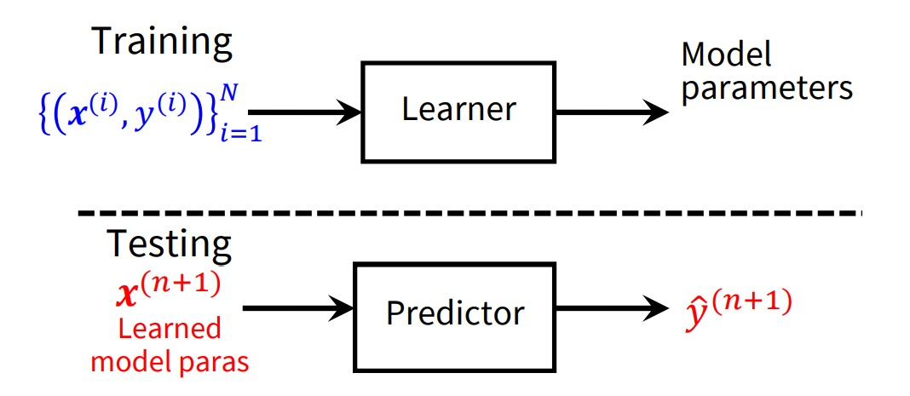

# Deep Learning

This repository keeps record of Deep Learning Course (ID: 521153S-3003) from University of Oulu, Finland.

## Packages

- Python 3.8
- Pytorch 1.10

## Content

### 1. Linear regression: loss function, gradient descent, regularization

Problem setting: given the training set, how to train a model to predict the output of a new value of the input from the testing set?

#### The solutions:

- **Step 1: define a set of functions**
  - Linear hypothesis:
  
      $$y = b + w_1 * x_1 + w_2 * x_2 + w_3 * x_3 + ... + w_n * x_n$$
      
       - $w_1$, ..., $w_n$ are known as weights (can be any values)
      
       - $b$ is known as bias term (can be any value)
      
     In short, the hypothesis can be written as ( $w$, $x$ as vectors):  
     
     $$\hat{y} = f(x) = b +  w ^ T x$$

- **Step 2: Goodness of the functions**
  - Loss/cost function: We want a line having small residuals. --> minimize the sum of squared residuals (least squares method).
  

    $$L(f) = L(w,b) = \frac{1}{2N} \sum_{i = 1}^{N} (y ^ i - (b + w ^ T x ^ i)) ^ 2$$
      
- **Step 3: Pick the best functions**
  - Minimize the cost (Gradient descent)

$${dL \over dw} = \frac{1}{N} \sum_{i = 1}^{N} (y ^ i - (b + w ^ T x ^ i))(-x ^ i) = 0 \implies w = {N \sum x ^ i y ^ i - \sum x ^ i \sum y ^ i \over N \sum x ^ i x ^ i - \sum x ^ i \sum x ^ i}$$

$${dL \over db} = \frac{1}{N} \sum_{i = 1}^{N} (y ^ i - (b + w ^ T x ^ i))(-1) = 0 \implies b = {\sum x ^ i x ^ i \sum y ^ i - \sum x ^ i y ^ i \sum x ^ i \over N \sum x ^ i x ^ i - \sum x ^ i \sum x ^ i}$$

Model selection

### 2. Linear Classification 

Examples: Pedestrian detection, Email spam detection, Tumor detection, Object classification
  
- Softmax Classifer (Multinomial logistic regression)
